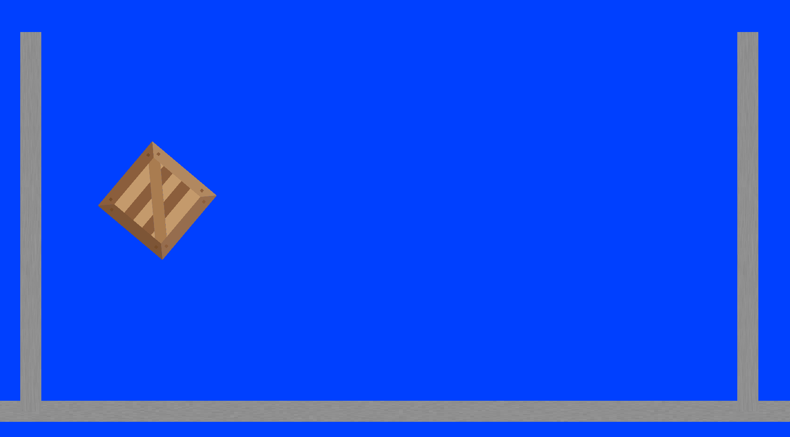

# Rust Physics Engine
A 2D physics engine built with Rust and SDL2.





### Features
  - Linear and angular motion simulation
  - Circle, box, and n-sided polygon rigid bodies
  - Collision detection and impulse resolution
  - Gravity, spring, friction, and drag forces 
  -	Custom textures
  - Vector operations


This project was written in Rust, which was an absolute joy to use. I included a brief [write-up of the of some noteworthy language features here](./nice_rust.md).

## Install
Install system dependencies

```
<!-- Linux -->
sudo apt install libsdl2-dev
sudo apt install lib2sdl-image-dev
sudo apt instal lib2sdl-gfx-dev

<!-- Mac -->
sudo apt install libsdl2-dev
sudo apt install lib2sdl-image-dev
sudo apt instal lib2sdl-gfx-dev
```

Clone and run
```
git clone git@github.com:frozberry/physics-engine-rust.git
cd physics-engine-rust
cargo run --release
```

## Controls

`Left Mouse` - Spawn ball

`Right Mouse` - Spawn box

`g` - Toggle gravity

`w` - Toggle wind

`d` - Toggle debug

`Esc` - Exit
